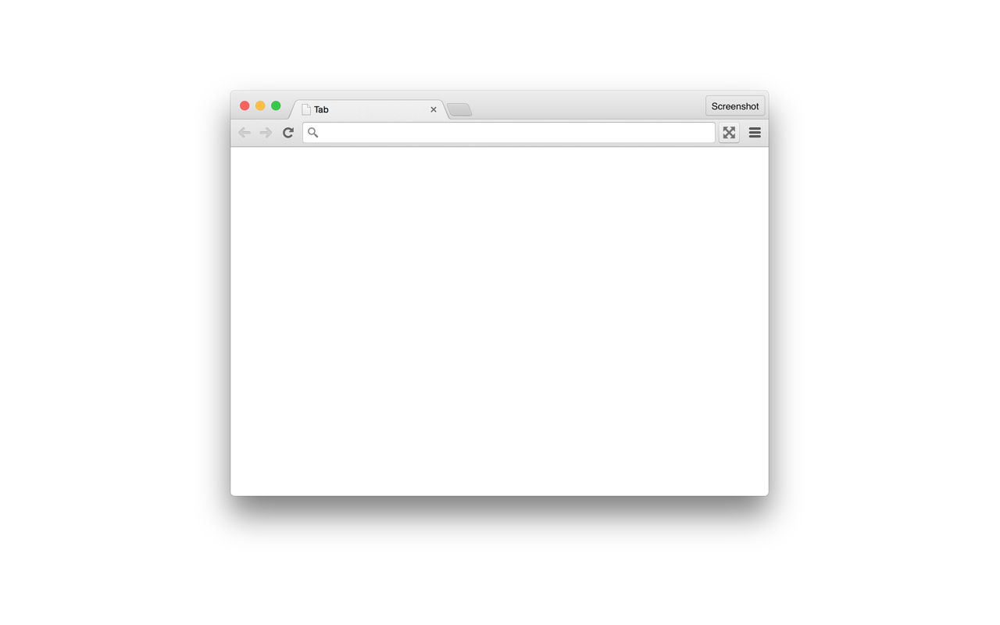

# Presentation Mode

Brings back presentation mode on OSX from Chrome 45 and earlier.

The default shortcut is `Ctrl-Shift-F`.
To use `Cmd-Shift-F`, you have to go to chrome://extensions, scroll to the bottom, and click on "Keyboard shortcuts". (This is because Cmd-Shift-F is now an alias for fullscreen, and the extension can't override the built-in shortcut on its own.)

